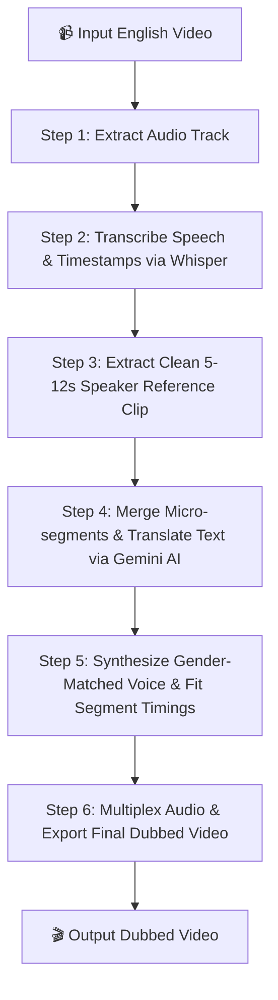

<div align="center">

# 🎙️ Video Dubbing AI
### Zero-Shot Voice Cloning & Multi-Language Video Translator

[](https://www.python.org/)
[](https://gradio.app/)
[](https://github.com/openai/whisper)
[](https://github.com/rany2/edge-tts)
[](https://ffmpeg.org/)

An end-to-end AI video translation system that translates English videos into **12 target languages** while preserving the original speaker's vocal identity, gender, pitch, accent, emotion, and segment timing!

[Key Features](#-key-features) • [How It Works](#-how-it-works) • [Setup Guide](#-setup-guide) • [Usage](#-usage) • [Supported Languages](#-supported-languages) • [Troubleshooting](#-troubleshooting)

---

</div>

## 📌 Overview

This project provides an automated pipeline for video translation and voice dubbing. Unlike standard text-to-speech tools that sound robotic and lose context, **Video Dubbing AI** extracts acoustic features (pitch, WPM, loudness, emotion) from the original speaker's voice to generate natural, time-synchronized dubbing in the target language.

---

## ✨ Key Features

| Feature | Description |
| :--- | :--- |
| 🗣️ **Zero-Shot Voice Cloning** | Preserves speaker identity without requiring any prior model training. |
| 🌐 **12 Target Languages** | Translate to Hindi, Bengali, Spanish, French, German, Japanese, Arabic, Chinese, Italian, Korean, Russian, or Portuguese. |
| ⏱️ **Precision Sync & Stretch** | Automatically time-stretches synthesized speech clips so total video duration and lip-sync cadence stay locked. |
| 👫 **Gender-Aware Pitch Detection** | Analyzes the fundamental frequency ($F_0$) to select male/female voice proxies automatically. |
| 📊 **Vocal Feature Profiling** | Extracts speaking rate (WPM), energy (RMS), pitch variance, and inferred emotional tone into JSON. |
| 🖥️ **Interactive Gradio Web UI** | Easy drag-and-drop web application with real-time step progress tracking and audio/video preview. |
| ⚡ **Dual Engine Architecture** | Uses high-performance Microsoft Edge-TTS with fallback support to zero-shot F5-TTS models. |

---

## 🏗️ How It Works

The dubbing process executes through a 6-step automated pipeline:



### Pipeline Breakdown

1. **Audio Extraction**: Extracts pristine original audio using `MoviePy` and `FFmpeg`.
2. **Speech Transcription**: Uses `OpenAI Whisper` to detect precise word-level timestamps and speech boundaries.
3. **Reference Extraction**: Automatically crops a clean 5–12 second sample of speech (`author_reference.wav`) for voice profiling.
4. **Context-Aware Gemini Translation**: Merges micro-segments into sentence blocks to maintain conversational flow and translates text using **Google Gemini LLM** (`google-genai` SDK loaded via `.env` configuration). Preserves emotions, tone, and natural code-switching (e.g., Hinglish), with automatic fallback to `deep-translator` (`GoogleTranslator`).
5. **Acoustic Synthesis**: Analyzes fundamental pitch ($F_0$) to choose male/female neural voices, then time-stretches each clip to fit exact segment boundaries.
6. **Video Re-muxing**: Combines the newly synthesized stereo audio track back into the video container.

---

## 📋 Prerequisites

| Component | Minimum Requirement | Recommended |
| :--- | :--- | :--- |
| **Python** | Python 3.9+ | Python 3.11 |
| **Media Toolkit** | FFmpeg installed & added to system PATH | FFmpeg 6.0+ |
| **Hardware** | 4-Core CPU, 8 GB RAM | NVIDIA CUDA GPU (for faster Whisper transcription) |
| **Internet** | Active connection for Edge-TTS synthesis | Broadband |

---

## 🚀 Setup Guide

### Step 1: Clone the Repository
```bash
git clone <repository-url>
cd video_dubbing
```

### Step 2: Install FFmpeg

FFmpeg is **required** for video and audio processing.

<details>
<summary><b>🪟 Windows Instructions</b></summary>

**Option A (Using Winget - Recommended):**
```cmd
winget install Gyan.FFmpeg
```

**Option B (Manual Installation):**
1. Download full build from [gyan.dev/ffmpeg/builds](https://www.gyan.dev/ffmpeg/builds/).
2. Extract the folder to `C:\ffmpeg`.
3. Add `C:\ffmpeg\bin` to your System Environment Path variable.
</details>

<details>
<summary><b>🍎 macOS Instructions</b></summary>

```bash
brew install ffmpeg
```
</details>

<details>
<summary><b>🐧 Linux Instructions</b></summary>

```bash
sudo apt update && sudo apt install -y ffmpeg
```
</details>

Verify that FFmpeg is installed correctly:
```bash
ffmpeg -version
```

### Step 3: Install Python Dependencies
Install the required libraries using `pip`:

```bash
pip install gradio openai-whisper moviepy numpy soundfile librosa edge-tts deep-translator google-genai python-dotenv torch torchaudio
```

### Step 4: Configure Environment Variables (.env)
Create a `.env` file in the root directory to configure your Gemini API credentials:

```env
GEMINI_API_KEY=your_gemini_api_key_here
GEMINI_MODEL=gemini-3.6-flash
```

> [!TIP]
> **Optional F5-TTS Support**: If you wish to enable local zero-shot F5-TTS fallback capabilities:
> ```bash
> pip install f5-tts
> ```

---

## 💡 Usage Guide

### Method 1: Web Interface (Recommended)

Launch the interactive Gradio web server:

```bash
python app.py
```

1. Open your browser and go to `http://127.0.0.1:7860`.
2. **Upload** your English video (`.mp4`, `.mov`, `.avi`, `.mkv`).
3. **Select** your desired target dubbing language.
4. Click **🎙️ Clone Author Voice & Translate Video**.
5. View progress real-time and preview/download your dubbed video!

---

### Method 2: Python API / Scripting

You can import and run the pipeline directly in python code:

```python
from voice_cloning_pipeline import process_voice_cloning_pipeline

# Run dubbing pipeline
output_video, output_audio, original_text, translated_text = process_voice_cloning_pipeline(
    video_path="input_english_video.mp4",
    target_language="Hindi",  # e.g., Hindi, Bengali, Spanish, French, etc.
    output_video_path="output/dubbed_output.mp4",
    audio_output_path="output/extracted_original.wav"
)

print("--- Dubbing Complete ---")
print(f"Original Text:   {original_text[:100]}...")
print(f"Translated Text: {translated_text[:100]}...")
print(f"Dubbed Video:    {output_video}")
```

---

### Method 3: Running Tests

Verify voice extraction and full pipeline integrity:

```bash
# Run stage 1 isolated voice extraction test
python voice_test.py

# Run full pipeline integration unit test
python test_pipeline.py
```

---

## 🌍 Supported Languages & Voice Models

| Language | Language Code | Neural Male Voice | Neural Female Voice |
| :--- | :---: | :--- | :--- |
| **Hindi** | `hi` | `hi-IN-MadhurNeural` | `hi-IN-SwaraNeural` |
| **Bengali** | `bn` | `bn-IN-BashkarNeural` | `bn-IN-TanishaaNeural` |
| **Spanish** | `es` | `es-ES-AlvaroNeural` | `es-ES-ElviraNeural` |
| **French** | `fr` | `fr-FR-HenriNeural` | `fr-FR-DeniseNeural` |
| **German** | `de` | `de-DE-ConradNeural` | `de-DE-KatjaNeural` |
| **Japanese** | `ja` | `ja-JP-KeitaNeural` | `ja-JP-NanamiNeural` |
| **Arabic** | `ar` | `ar-SA-HamedNeural` | `ar-SA-ZariyahNeural` |
| **Chinese (Mandarin)** | `zh-CN` | `zh-CN-YunxiNeural` | `zh-CN-XiaoxiaoNeural` |
| **Italian** | `it` | `it-IT-DiegoNeural` | `it-IT-ElsaNeural` |
| **Korean** | `ko` | `ko-KR-InJoonNeural` | `ko-KR-SunHiNeural` |
| **Russian** | `ru` | `ru-RU-DmitryNeural` | `ru-RU-SvetlanaNeural` |
| **Portuguese** | `pt` | `pt-BR-AntonioNeural` | `pt-BR-FranciscaNeural` |

---

## 📁 Output Artifacts Directory

When a video is processed, all generated assets are organized inside the `output/` directory:

```
output/
 ├── processed_video.mp4          # Final video file with translated audio track
 ├── cloned_hindi_voice.wav       # Master synthesized translated audio track
 ├── preserved_original_voice.wav # Extracted original video audio track
 ├── author_reference.wav         # Clean 5-12s speaker voice reference audio
 ├── author_reference.txt         # Text transcript matching author_reference.wav
 └── author_voice_profile.json    # JSON report of vocal pitch, WPM, energy & emotion
```

---

## 🔍 Troubleshooting & FAQ

> [!WARNING]
> **FFmpeg Not Found**:
> If you get `FFmpeg is not installed or not on PATH`, make sure FFmpeg is installed and `ffmpeg.exe` is added to your environment path. Restart your terminal after adding environment variables.

> [!NOTE]
> **No Speech Detected**:
> Whisper requires clear spoken English. Videos with loud background music or very low speech volume may yield empty transcriptions.

> [!TIP]
> **Windows ConnectionResetError**:
> The pipeline uses `WindowsSelectorEventLoopPolicy` to prevent harmless Windows socket cleanup warnings when running inside web servers like Gradio.

---

## 🛠️ Built With

* [OpenAI Whisper](https://github.com/openai/whisper) — Automatic Speech Recognition (ASR) & Timing
* [Google Gemini API](https://ai.google.dev/) — Context-Aware LLM Dialogue Translation (`google-genai`)
* [Microsoft Edge TTS](https://github.com/rany2/edge-tts) — High-Definition Neural Speech Synthesis
* [F5-TTS](https://github.com/SWivid/F5-TTS) — Zero-Shot Voice Cloning Fallback Engine
* [MoviePy](https://zulko.github.io/moviepy/) & [FFmpeg](https://ffmpeg.org/) — Audio-Video Muxing & Editing
* [Librosa](https://librosa.org/) & [SoundFile](https://python-soundfile.readthedocs.io/) — Acoustic Feature Analysis & Time Stretching
* [Deep Translator](https://github.com/nidhaloff/deep-translator) — Multi-Engine Text Translation Fallback
* [Gradio](https://gradio.app/) — Graphical Web Application Framework

---

## 📜 License

This project is open-source and intended for educational, research, and personal use.
